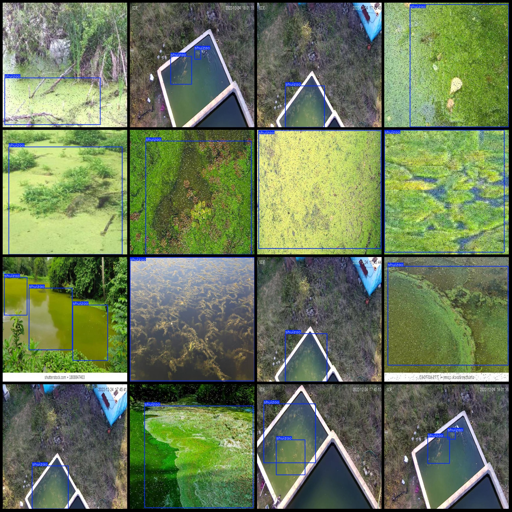
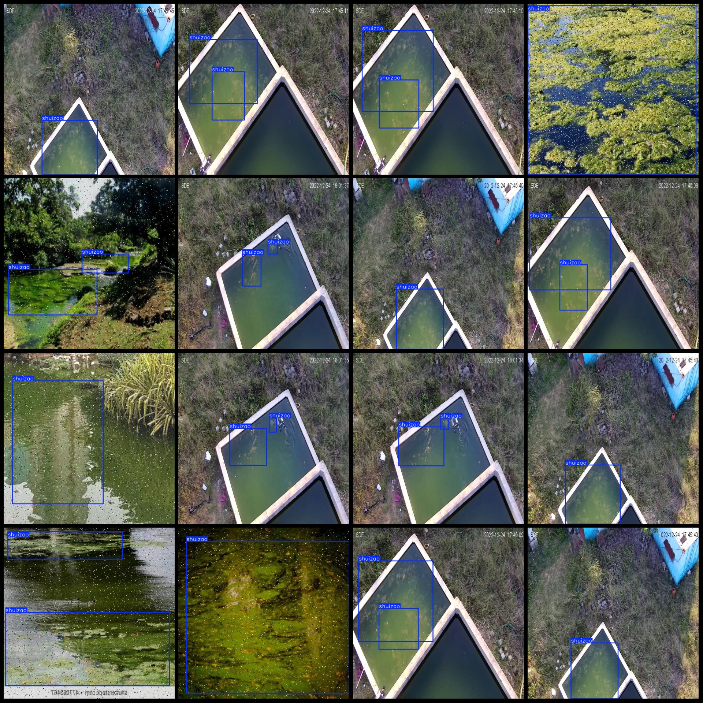

# Water Algae Detection Data Set - VOC+YOLO-Format: 624 Images, 1 Classification

Dataset format: Pascal VOC format + YOLO format (without split path in txtfile, only contain jpgimage and corresponding VOC format xmlfile and yolo format txtfile)
number of images: 624  
Number of XML files: 624
annotation count: 624  
annotationnumber of classes: 1  
Category Name: ["shuizao"]
The number of boxes labeled in each category:
shuizao box count = 1049  
Total number of frames: 1049
images per class:   
Shuizao's possession of images = 624.
Image resolution: 640x640
Annotation tool: labelImg
Annotation rules: Draw a rectangle around the class.
Important notes: The dataset does not have a training/validation/test split. You need to manually divide it.
Special statement: This dataset does not guarantee any accuracy for the trained model or weight file.
Image preview:
## Images

Here is a pay link on Stripe ( https://buy.stripe.com/3cs8yP7sY87d0vu9AB ). Please contact me lonlonago@foxmail.com after funding $89, and I will send you a complete data files , thank you!

